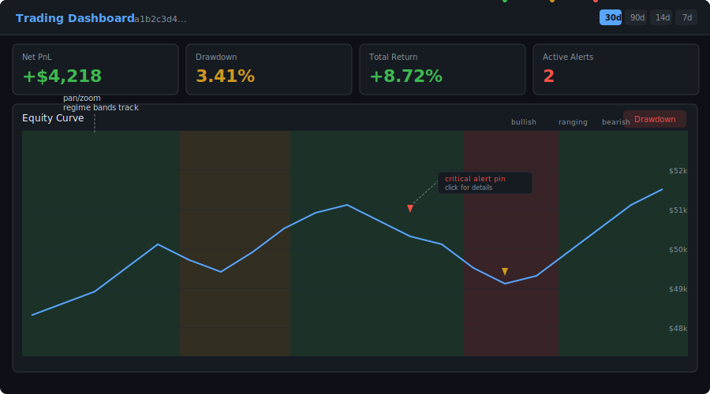
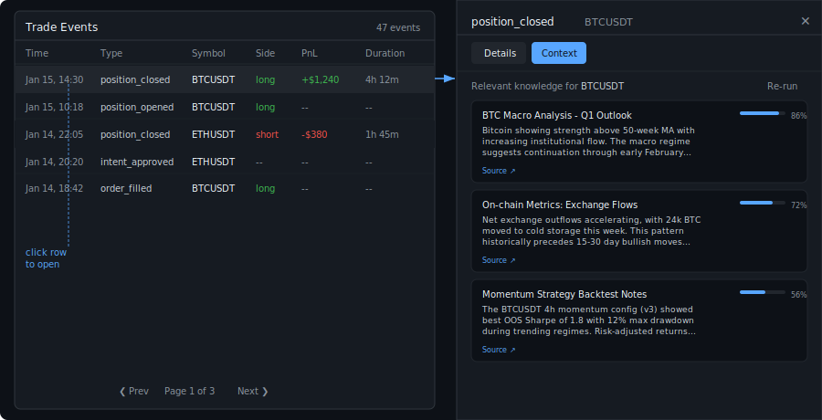
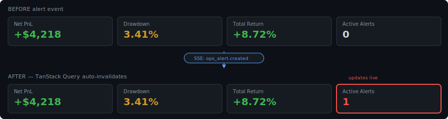

# Trading RAG

Multi-tenant RAG platform for trading research, backtesting, and strategy evaluation.

[](https://github.com/afk-bro/trading-RAG/actions/workflows/ci.yml)


> **Why this dashboard exists** — This dashboard exists to make trading system
> behavior visually obvious: how equity responds to market regimes, alerts, and
> strategy changes — not just whether it made money. Regime-colored bands show
> *when* the system was confident, alert pins show *where* risk events occurred,
> and the RAG context tab shows *why* a trade was taken. Numbers tell you what
> happened; this tells you whether you should trust it.

## Dashboard

React SPA with regime-aware equity chart, alert markers, and RAG-backed trade context.

**Equity curve with regime strip and alert pins** — colored bands track market regime (bullish/bearish/ranging), alert markers pin risk events to the timeline:



**Trade Explorer with RAG context drawer** — click any trade event to see related events and semantically retrieved knowledge chunks:



**KPI cards with live SSE updates** — alert count updates automatically when the backend fires an event:



```
┌─────────────────────┐
│   React Dashboard    │
│  (Vite + TypeScript) │
└──────────┬──────────┘
           │ REST + SSE
┌──────────▼──────────┐
│      FastAPI         │
│     (rag-core)       │
└──┬───────┬───────┬──┘
   │       │       │
   ▼       ▼       ▼
Postgres  Qdrant  Redis
```

```bash
make dashboard-dev    # Vite dev server at :5173/dashboard/
make dashboard-build  # Production build → dashboard/dist/
```

## Highlights

- **Async-first FastAPI service** with 221 test files, CI pipeline (lint + unit + integration), and Prometheus alerting (28 rules across 10 subsystems)
- **Multi-source ingestion** — YouTube transcripts, PDFs, Pine Script, articles, and raw text with token-aware chunking (tiktoken, 512-token windows)
- **Two-stage retrieval** — Qdrant vector search with optional cross-encoder reranking (BGE-reranker-v2-m3), neighbor expansion, and LLM answer synthesis
- **Backtest engine** — Grid/random parameter tuning, walk-forward optimization, IS/OOS splits with overfit detection, and a leaderboard
- **Production-grade ops** — Sentry, structured logging, rate limiting, admin auth, workspace isolation, Telegram alerting with escalation, auto-pause guardrails

## Architecture

```
Sources (YouTube, PDF, Pine, Articles, Text)
                │
                ▼
      ┌───────────────────┐
      │   FastAPI Service  │
      │     (rag-core)     │
      └────────┬──────────┘
               │
    ┌──────────┼──────────┬──────────────┐
    ▼          ▼          ▼              ▼
 Ollama     Qdrant    Supabase     Workspaces
(Embed)    (Vector)  (Postgres)    (Control)
```

**Data flow:** Content → Extract → Chunk (512 tokens) → Embed (768-dim) → Store in Vector DB + Postgres

## Tech Stack

| Layer | Technology |
|-------|-----------|
| API | FastAPI, async (asyncpg, httpx) |
| Embeddings | Ollama (nomic-embed-text, 768-dim) |
| Vector DB | Qdrant |
| Primary DB | Supabase PostgreSQL (76 migrations) |
| Reranking | sentence-transformers (BGE-reranker-v2-m3) |
| LLM | OpenRouter API (optional) |
| Backtesting | Backtesting.py, pandas, numpy |
| Market Data | CCXT (exchanges), Databento (CME futures) |
| Monitoring | Prometheus, Sentry, structlog |
| Admin | Jinja2 templates, Telegram notifications |

## Features

### RAG Core
- Unified ingest endpoint with auto-detection (YouTube, PDF, Pine Script, article, text)
- Token-aware chunking with overlap and page/timestamp tracking
- Semantic search with payload filtering (source type, symbols, topics)
- Optional LLM answer generation with citations (graceful degradation when disabled)
- Cross-encoder reranking with timeout fallback and neighbor expansion
- Model migration support (re-embed endpoint for model upgrades)

### Backtesting & Strategy
- Parameter tuning with grid/random search and configurable objectives
- Walk-forward optimization with IS/OOS splits and overfit detection
- Pine Script registry with linting, auto-strategy discovery, and CLI tooling
- KB-driven parameter recommendations with regime fingerprints
- Paper execution with equity tracking and drawdown alerts

### Operations & Admin
- Admin dashboard with leaderboard, coverage triage, ops snapshot, document QA
- Ops alerting with Telegram delivery (activation, recovery, escalation)
- Auto-pause guardrail for CRITICAL drawdown alerts
- Rate limiting, CORS allowlist, workspace isolation
- Prometheus alerting rules (28 alerts across 10 subsystems)

## Quick Start

### Prerequisites

- Docker and Docker Compose
- Supabase project (Postgres + auth)
- OpenRouter API key (optional — only for LLM answer generation)

### Setup

```bash
# Clone and setup
git clone https://github.com/afk-bro/trading-RAG.git
cd trading-RAG
make setup

# Configure .env (SUPABASE_URL and SUPABASE_SERVICE_ROLE_KEY are required)
vim .env

# Start services
make docker-up
```

API available at http://localhost:8000 — interactive docs at http://localhost:8000/docs

### Usage

```bash
# Ingest a YouTube transcript
curl -X POST http://localhost:8000/sources/youtube/ingest \
  -H "Content-Type: application/json" \
  -d '{"workspace_id": "YOUR_WS_ID", "url": "https://youtube.com/watch?v=VIDEO_ID"}'

# Semantic search
curl -X POST http://localhost:8000/query \
  -H "Content-Type: application/json" \
  -d '{"workspace_id": "YOUR_WS_ID", "question": "What is the current macro outlook?", "mode": "retrieve", "top_k": 5}'

# Run a backtest parameter sweep
curl -X POST http://localhost:8000/backtests/tune \
  -H "Content-Type: application/json" \
  -d '{"workspace_id": "YOUR_WS_ID", "strategy_entity_id": "STRATEGY_ID", "param_space": {"fast_period": [5, 10, 20], "slow_period": [20, 50, 100]}, "objective_type": "sharpe_dd_penalty", "oos_ratio": 0.3}'
```

## Project Structure

```
trading-RAG/
├── app/
│   ├── main.py                 # FastAPI application entry point
│   ├── routers/                # API endpoints (thin controllers)
│   ├── services/               # Business logic (chunker, embedder, llm, pine)
│   ├── repositories/           # Data access (documents, chunks, vectors)
│   ├── admin/                  # Admin UI (router + Jinja2 templates)
│   ├── deps/                   # Auth, rate limiting, concurrency
│   └── jobs/                   # Async job handlers
├── dashboard/                  # React SPA (Vite + TypeScript + Tailwind)
│   ├── src/
│   │   ├── api/                # Typed API client + endpoint functions
│   │   ├── components/         # UI components (equity chart, trades, KPI)
│   │   ├── hooks/              # React Query hooks, SSE, URL state
│   │   └── pages/              # Dashboard page composition
│   └── dist/                   # Production build (gitignored)
├── tests/                      # 221 test files (unit, integration, e2e)
├── migrations/                 # 76 SQL migrations
├── ops/                        # Prometheus alerting rules
├── dashboards/                 # Grafana dashboards
├── docs/
│   ├── dashboard/              # Dashboard screenshots and diagrams
│   ├── features/               # Feature documentation
│   ├── ops/                    # Runbooks, alerting, hardening
│   └── reranker/               # Reranker component docs
├── docker-compose.rag.yml
├── Dockerfile                  # Multi-stage: Node build + Python runtime
├── Makefile
└── requirements.txt
```

## Development

```bash
make setup           # Create venv, install deps, copy .env.example
make dev             # Start uvicorn with hot reload
make test            # Run unit tests
make test-all        # Run full test suite
make lint            # black --check + flake8 + mypy
make format          # Auto-format with black
make clean           # Remove caches and build artifacts
make dashboard-dev   # Vite dev server (localhost:5173/dashboard/)
make dashboard-build # Production build → dashboard/dist/
```

### CI Pipeline

Runs on every push: lint (black, flake8, mypy) → unit tests → integration tests. Nightly: full integration suite + smoke tests.

## License

MIT
